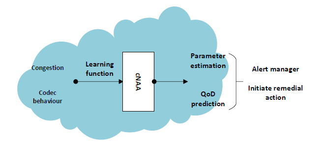

# [Predicting Quality of Delivery Metrics for Adaptive Video Codec Sessions](https://ieeexplore.ieee.org/abstract/document/9335813)

This paper introduces a novel algorithm, Codec-aware Network Adaptation Agent (CNAA), designed for predicting video quality metrics such as jitter for video services. CNAA is an online lightweight data learning engine that leverages network information to accurately predict quality of delivery (QoD) metrics even in the presence of congestion and adaptive codecs. The research emphasizes the importance of accurate prediction of video quality given the dominance of video traffic and the strain it poses on limited bandwidth constraints. It highlights shortcomings of baseline machine learning techniques in capturing network dynamics and demonstrates the superior performance of CNAA over state-of-the-art algorithms. The efficacy of CNAA is demonstrated across varying network and codec conditions, underscoring the significance of incorporating network dynamics into machine learning approaches for accurate predictions in cloud-hosted services.

# 

Figure 1 illustrates the role of the CNAA agent in the QoD prediction ecosystem. The
learning function incorporates network dynamics, namely, congestion and
codec behaviour in QoD parameter estimation and prediction. The prediction
outputs can be fed into an intermediary network device (e.g. a router) or sent
to a network manager to either take remedial or proactive action.
