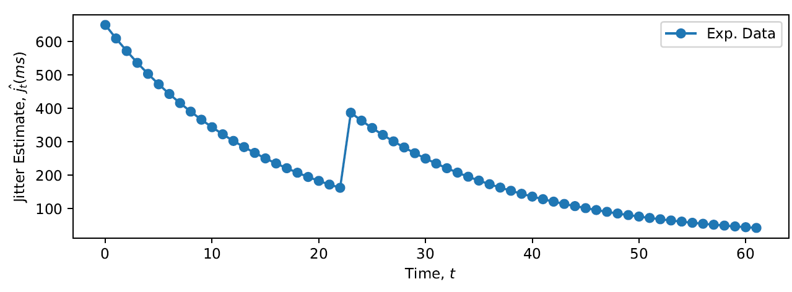

# [Predicting Quality of Delivery Metrics for Adaptive Video Codec Sessions](https://ieeexplore.ieee.org/abstract/document/9335813)

This paper introduces a novel algorithm, Codec-aware Network Adaptation Agent (CNAA), designed for predicting video quality metrics such as jitter for video services. CNAA is an online lightweight data learning engine that leverages network information to accurately predict quality of delivery (QoD) metrics even in the presence of congestion and adaptive codecs. The research emphasizes the importance of accurate prediction of video quality given the dominance of video traffic and the strain it poses on limited bandwidth constraints. It highlights shortcomings of baseline machine learning techniques in capturing network dynamics and demonstrates the superior performance of CNAA over state-of-the-art algorithms. The efficacy of CNAA is demonstrated across varying network and codec conditions, underscoring the significance of incorporating network dynamics into machine learning approaches for accurate predictions in cloud-hosted services.

<!-- #  -->

    
     
    <em>Figure 1: The role of the CNAA agent is illustrated.</em>

Figure 1 illustrates the role of the CNAA agent in the QoD prediction ecosystem. The learning function incorporates network dynamics, namely, congestion and codec behavior in QoD parameter estimation and prediction. The prediction outputs can be fed into an intermediary network device (e.g. a router) or sent
to a network manager to either take remedial or proactive action.

    
     
    <em>Figure 2: The experimental testbed is shown.</em>

Figure 2 illustrates the laboratory network set-up for a video streaming session between a server and a client machine using physical Cisco hardware routers. In the network, six routers (R1 - R6, all Cisco 2911 Integrated Services Routers (ISR)) are connected between the server and the client. Both the server and client machines are 64-bit Windows 7 operating system computers. The clocks on the server and the client are synchronized using the Network Time Protocol to match observations from both. Network jitter samples are drawn from the client machine every second. The streaming session is set up on the server machine with the VLC server using the Real-Time Transport Protocol (RTP). The Big Buck Bunny mp4 animation video, approximately 10 minutes long, is used for experiments. Transcoding of the pre-encoded file to either H.264 or H.265 is activated. At this stage, no further default VLC encoding parameters are altered, leaving the bitrate and frame rate, etc., the same as the source file.

    
     
    <em>Figure 3: Network traces show the adaptive behaviors of the codecs in response to the network congestion.</em>

Rows 1 (R1) and R2 display traces showing the adaptive behavior of H.264 and H.265 codecs to network congestion. Maximum, minimum, and mean instantaneous jitter values in R1 are (650ms, 1.17ms, 107ms), and in R2 are (750ms, 3.91ms, 126ms) respectively. The structured nature of these time series is noteworthy.

    
     
    <em>Figure 4: An extract is taken from the jitter traces showing the exponential decaying nature of the jitter time series data.</em>

Figure 4 displays an excerpt from the data presented in Row 1, Figure 3. The network jitter time series data can be observed to exhibit an exponentially decaying pattern. Therefore, we assume the unit exponential decay function. The CNAA model enables summarization of jitter time series using the following feature set:
    * The peak value of the time series exponentially decaying curves
    * The decay, and 
    * The period.
All three features represent the adaptation of the codec in response to different network conditions.

 \begin{table}[h]
\centering
\vspace{2mm}
\caption{Codec-aware Network Adaptation Agent (cNAA) Versus Baseline Models; compared with the best performing baseline model, EWMA, cNAA techniques offer $\approx$ 95.8\% and 93.8\% performance improvements in terms of RMSE and MAE respectively.}\label{tab:cNAAvOthers} 
\begin{tabular}{@{\extracolsep{4pt}}lllcc}
\toprule   
 Method & {} & {} & RMSE & MAE \\ 
\midrule
\textbf{cNAA} & {} & {} & \textbf{4.82} & \textbf{4.07} \\ 
EWMA  & {} & {} & 115.84 & 65.50\\
SMA  & {} & {} & 138.88 & 81.24\\
LR  & {} & {} & 119.66 & 91.92 \\
ARMA(2,1) & {} & {} & 119.16 & 89.76 \\
  
\bottomrule
\end{tabular}
\end{table}
